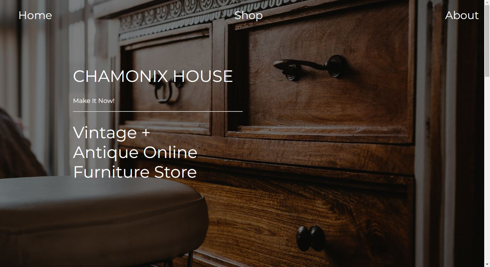

# SkillsUSA Round One - Chamonix House

I misplaced the informational packet we were given, so I'm going to try to recite the details of the project from memory 
(spoiler alert: I do not have photographic memory)

For this competition, we were given a packet of information for a Vintage and Antique Online Furniture Store.
The packet explained that were were to create a three-page site (Home, Shop, About) for the customer "Chamonix". 
The customer provided some copy/paste text about them, their vision, etc. We also had to create a wireframe for the 
customer. The wireframe was supposed to be low-fidelity, but my partner and I ended up creating a high-fidelity one. More notes on that later. 

We had a total of six hours to complete the project. This was done in one-sitting and in a computer-lab with the other competitors. 

## Example Output



## Analysis Steps

In the last competition we had, the previous judge asked why we did not go with the first wireframe that had been developed...
it happened to be my wireframe so this time around I made the majority of design calls. My partner selected a few pictures that I would give a
thumbs-up to if it fit the vision and design I had in mind. This is partially why we went with a high fidelity wireframe. I wanted to make sure 
both of us were on the same page when it came to the design of the website. I also took a bit of inspiration from [Restoration House](https://rh.com).

We both concluded that if we spent a good chunk of time developing an amazing wireframe, down the road, we would save lots of time because we knew exactly what we 
wanted. 


### Design

This was the gameplan. After we finished the [wireframe on Figma](https://www.figma.com/file/ZwG90OngHSmm47bk0nxMcG/SkillsUSA-Round-One?node-id=0%3A1&t=cKmElAKdG14VoZwY-0), 
we split up the work in a similar fashion as we did in our previous competition. I was going to do the home page, he would do the shop page, and then we'd work together on
the about page. We would then merge pull requests intermittently throughout the course of the event to make sure we were both on the samge page. 


### Implementation

Step One

```
I created the navigation bar, the footer, and styles such as fonts, colors, general spacing, etc. 
These were things global to the entire website so I knew it had to be developed quick and it had to be developed properly so that
we wouldn't have to come back to it in the future. I did not know at the time, but it was definitely evident later, it is much harder to fix the navigation bar once everything
has been formattted and added. More on this later. 
```

Step Two

```
After committing the global items, I got started on the home/landing page whilst Benjamin started on the shop page. I hate to admit it, but I spent a significant portion of 
our time working on the first viewport of the home page because I needed to refresh myself on obtaining the shadow effect over the image that I needed. And as most things, in
code go, once I reached the solution I realized it was something minor... like something that took one minute to implement. From here it was pretty smooth sailing. 
```

Step Three

```
Once the homepage was done, we realized that time was getting short and my partner was still working on the shop page. I decided to take over the about page because I knew I
could develop it quickly and make it look good as well. Of all the pages, this one was the quickest, only taking about twenty minutes to create and format the entirety of it. 
I was about halfway done when my partner finished the shop page. It was at this point that I realized that his navigation bar did not match the navigation bar for the rest
of the website. There were only 15 minutes left at this point and fixing it would take a considerable amount of time, so I did as good of a Band-Aid solution as I could, but 
it was not enough to cover up the fact that the navbar was different. 
```

Step Four

```
Finally, I polished up the about page and made any minor adjustments to site that I could in the ten remaining minutes. At this point, my brain was fried from focusing on a
computer screen for 6 consecutive hours so I didn't catch the typo on one of the pages. You win some, you lose some. 
```

At the end, I was extremely pleased with the final product. Those long six hours were completely worth it once I was able to fully recognize the fruits of our labor. I didn't
have to wait to hear back from the judge to know that our site was going to take first place and I don't mean that in a egotistical manner. The website looked extremely
professional. 

## Notes

This project was extremely fun and very fulfilling! It was the culmination of all my studying so far at OTC minus the "extra seasoning" per se. I wasn't able to implement fancy
JavaScript because of the time contraints, but the things I was able to apply, I was able to do excellently. We also received feedback from the judge for this competition and
his notes are as follow:

- The website was sleek and modern
- Great use of real estate
- Great selection of images
- Overall a great site, with very few negatives
- The mockups looked very nice, but they were supposed to be low-fidelity mockups
- The navbar isn't consistent across all pages, but I like the on-hover transparency
- The home page had a great blend of images, but had some text overlap that could be fixed
- I liked the off-centered "Learn More" button on the home page
- The shop page could have benefitted with three columns instead of two
- The instructions asked for the products to be grouped into sections, in this case, they were not so it counted against you
- Good job sectioning off the client copy/paste text and not doing a wall of text on the about page
- The redundant navigation button back to the shop is a plus

Onward to State!

## Do not change content below this line
## Adapted from a README Built With

* [Dropwizard](http://www.dropwizard.io/1.0.2/docs/) - The web framework used
* [Maven](https://maven.apache.org/) - Dependency Management
* [ROME](https://rometools.github.io/rome/) - Used to generate RSS Feeds

## Contributing

Please read [CONTRIBUTING.md](https://gist.github.com/PurpleBooth/b24679402957c63ec426) for details on our code of conduct, and the process for submitting pull requests to us.

## Versioning

We use [SemVer](http://semver.org/) for versioning. For the versions available, see the [tags on this repository](https://github.com/your/project/tags). 

## Authors

* **Billie Thompson** - *Initial work* - [PurpleBooth](https://github.com/PurpleBooth)

See also the list of [contributors](https://github.com/your/project/contributors) who participated in this project.

## License

This project is licensed under the MIT License - see the [LICENSE.md](LICENSE.md) file for details

## Acknowledgments

* Hat tip to anyone who's code was used
* Inspiration
* etc
